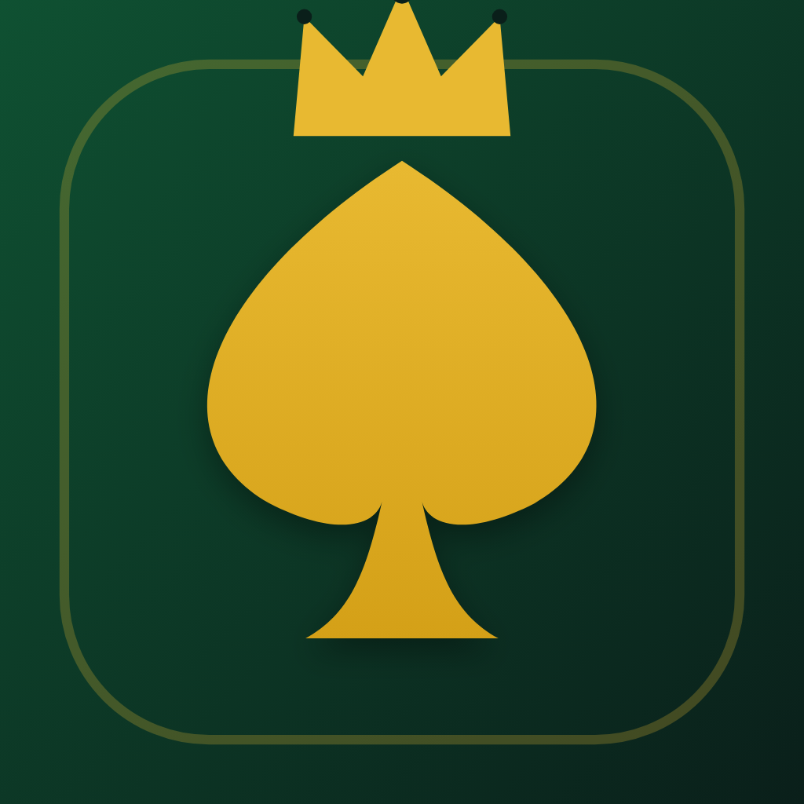

# Black Queen Scorer

A fast, offline score tracker for bidding-based team card games (Court Piece, Rang, 29, Partner 29, Black Queen, and similar variants). Built with Flutter for iOS and Android.

<p align="center">
  
</p>

## What it does

The app replaces the pen-and-paper scoring sheet that one person always ends up maintaining on card nights. It does **not** simulate card play — it only handles scoring.

- Session setup for 4 to 12 players
- Round entry in under 10 seconds (custom numeric keypad, no OS keyboard)
- Always-correct math (totals are recomputed from the rounds list on every change)
- Optional bidder bonus that applies only to the bidder
- Live leaderboard with animated reorder and score pulses
- Full round history; every round is editable
- Celebratory finish screen with podium, fun stats, and a shareable WhatsApp-ready card
- Lifetime stats aggregated across every session
- 100% offline — no account, no network calls, no tracking, no ads

## Stack

| Concern | Package |
|---|---|
| Framework | Flutter 3.24+ (Material 3) |
| State | `flutter_riverpod` |
| Routing | `go_router` |
| Local storage | `hive` + `hive_flutter` (hand-written TypeAdapters, no codegen) |
| Icons | `phosphor_flutter` |
| Share | `share_plus` + `screenshot` |

## Project layout

```
lib/
├── main.dart / app.dart
├── core/
│   ├── router/        go_router config
│   ├── theme/         design tokens, ThemeData, theme controller
│   ├── utils/         formatters, haptics
│   └── strings.dart
├── data/
│   ├── models/        Round, Session, SessionSettings + Hive adapters
│   ├── storage/       Hive box setup, SessionRepository, PlayersRepository
│   ├── providers.dart Riverpod providers
│   └── scoring.dart   pure scoring engine (single source of truth for scores)
├── features/
│   ├── home/          branded home with resume card + lifetime stats card
│   ├── session_setup/ 4-12 player picker + bonus toggle
│   ├── scoreboard/    live leaderboard + rounds list
│   ├── round_entry/   bidder + team + bid keypad + Won/Lost
│   ├── summary/       podium + fun stats + share
│   ├── history/       past sessions + lifetime stats
│   └── settings/      theme, manage recent players, debug seeder
└── shared/widgets/    app button, scaffold, empty state, confirm dialog
```

All of `lib/data/scoring.dart` is pure Dart, covered by 15+ unit tests, and is the single source of truth for scores. The UI never caches totals.

## Running locally

```bash
flutter pub get
flutter run
```

## Regenerating icons and splash

Icons and splash are painted programmatically — no design-tool round-trips needed:

```bash
# 1. Paint the master PNGs into assets/icon/
flutter test tool/generate_icon_test.dart

# 2. Generate per-platform icons
dart run flutter_launcher_icons

# 3. Generate native splash screens
dart run flutter_native_splash:create
```

## Testing

```bash
flutter test           # 21 tests — scoring engine, models, round-entry flow
flutter analyze        # zero warnings expected
```

## Publishing

See [`PUBLISHING.md`](./PUBLISHING.md) for the full release guide (signing, bundle IDs, store metadata, release builds).

Store-ready content lives in [`store/`](./store):

- `store/metadata/app-store.md` — copy for App Store Connect
- `store/metadata/play-store.md` — copy for Play Console
- `store/privacy-policy.md` — privacy policy (publish at `/privacy` on your domain)
- `store/landing-page/index.html` — AEO-optimized landing page (with `MobileApplication` + `FAQPage` JSON-LD schema)
- `store/screenshots/README.md` — shot list, sizes, framing tools, captions

## License

Copyright © 2026. All rights reserved.
